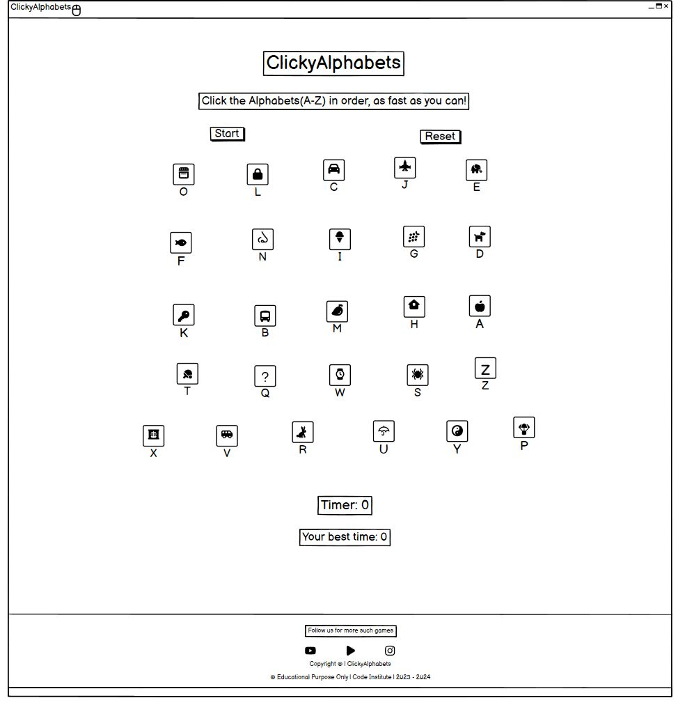
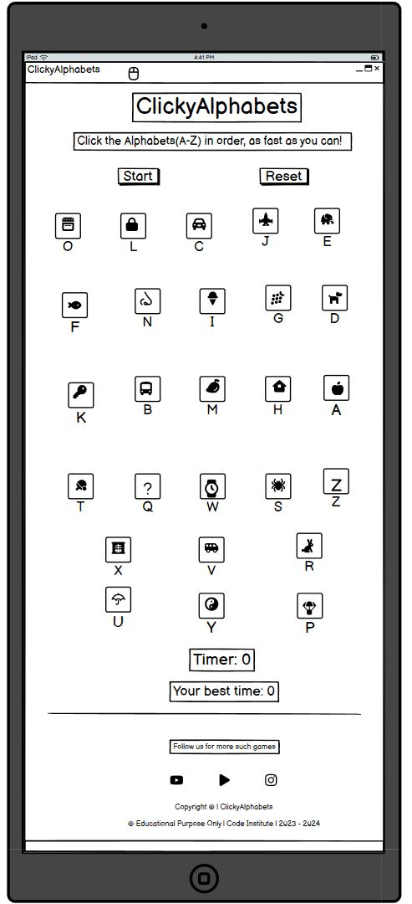
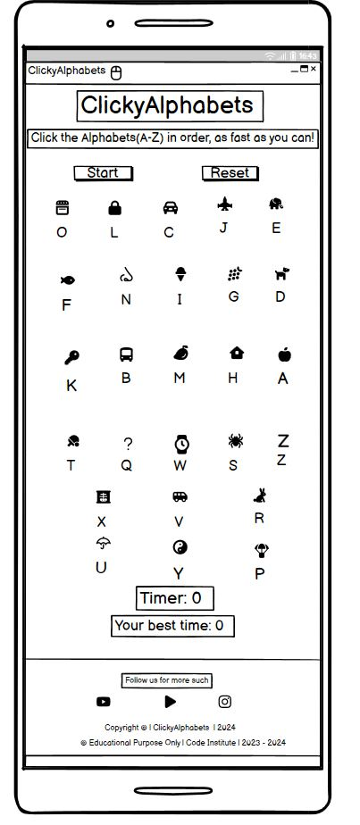

<h2>Welcome</h2>

# <h1 align="center">ClickyAlphabets</h1>

view the live project [CLICK HERE!](https://swathikeshavamurthy.github.io/Clicky-Alphabets-P1/)

# Introduction

 [ClickyAlphabets website](), engage the users in self-defeating competition and simple entertainment in addition to mental exercise. While you try to beat your personal record, the game is entertaining, simple to learn, and has the potential to become slightly addictive.

# Table of Contents

- [ClickyAlphabets](#clickyalphabets)
- [Introduction](#introduction)
- [Table of Contents](#table-of-contents)
- [User Goals and Stories (UX)](#user-goals-and-stories-ux)
    - [Website Owner and User Goals](#website-owner-and-user-goals)
      - [The owner's goals](#the-owners-goals)
      - [The user's goals](#the-users-goals)
    - [Website Owner and User Stories](#website-owner-and-user-stories)
      - [The owner's stories](#the-owners-stories)
      - [The user's stories](#the-users-stories)   
- [Design of the website](#design-of-the-website)
  - [Wireframes](#wireframes)
  - [Fonts](#fonts)
  - [Color Scheme and Colors](#color-scheme-and-colors)
  - [Images](#images)
  - [Icons](#icons)
  - [Text](#text)  
- [Features](#features)
  - [Existing Features](#existing-features)
    - Title of the Game
    - Game description
    - Start button
    - Reset button
    - Cursor
    - Alphabets
    - Timer
    - Best Time  
  - [Future Features](#future-features)

# User Goals and Stories (UX)

## Website Owner and User Goals

### The owner's goals

- The purpose of the entertaining and engaging game is to draw visitors to the website.
- The website's owner wants visitors to stay put.
- More games ought to be played by returning visitors.

### The user's goals

- The user wants to play a game on their preferred device that is simple to access.
- To keep things from getting monotonous, the game should offer some challenge.
- It must be easy to start playing whenever they want to pass the time.

## Website Owner and User Stories

### The owner's stories

- The owner values it when visitors return to the website and want to play additional games.
- A competitive element that will aid in achieving those objectives can be added by using a timer or another comparable game element.
- Additional revenue could be generated by the website with sufficient traffic and user retention.

### The user's stories

- The user wants to pass the time, but what they do need to offer some sort of challenge. 
- It must be quick and simple for users to pick up and play wherever they are.
- They are certain to return for more if the game allows them to compete against one another.

# Design of the website

To help users find what they're looking for quickly and precisely without having to scroll through a ton of content, the website is divided into four distinct pages.

Information about the products and the uses are the site's top priorities. Additionally, through links with clear labels, the user can access the products and enquire page.

Along with this a Thank you page will open after submitting in the enquire form.

Users can enquire about the products and get installed  using the form on the enquire now page.

The company's motto is to "increase Electric Vehicles (EV) chargers accessibility to all at very cheap and quality product".
The layout is kept uncomplicated and tidy and has been used minimalist colour scheme and design.

# Design of the website

To help users the website and game has been designed userfriendly.

## Wireframes

Here are the first wireframes from the design stage. Every design element was put into practice with the help of [Balsamiq Wireframes](https://balsamiq.com/wireframes/)

  

## Fonts

[Google Fonts](https://fonts.google.com/) were used to import the fonts. Fonts chosen were "Kalam" and "Lato". "sans serif" was chosen as the backup font.

## Color Scheme and Colors

Color black, and white was chosen for the font color as it attracts the users eyes.

The dark green and maroon color for Start Game and Reset Game buttons. Red and Green for correct and incorrect click on images.

## Images

Images were downloaded from Pexels and Pinterest and resized for the purpose of this website. The owners are credited in the Credits section.

## Icons

Icons were taken from Fontawesome website [Fontawesome](https://fontawesome.com/) and resized using [Favicon.io](https://favicon.io/).

# Features

## Existing Features

### Title of the Game

### Game Description

A synopsis of how the game is played.

Without being overbearing with information, this will help new players quickly grasp how the game is played.

