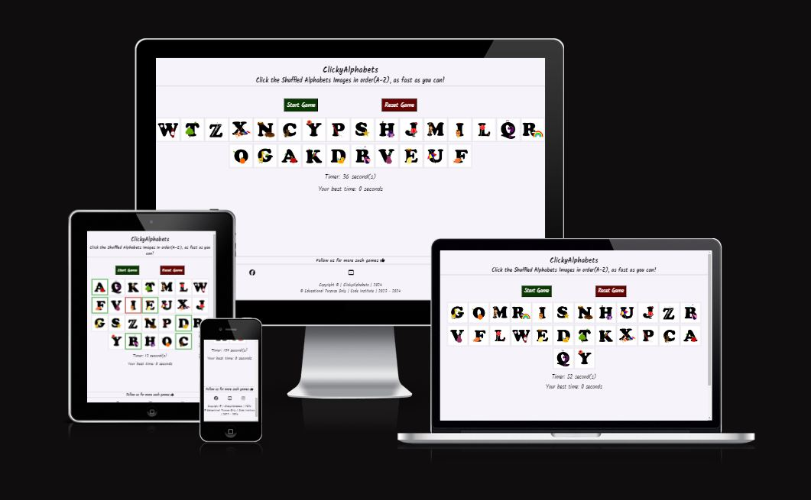

<h2>Welcome</h2>

# <h1 align="center">ClickyAlphabets</h1>

view the live project [CLICK HERE!](https://swathikeshavamurthy.github.io/Clicky-Alphabets-P1/)

# Introduction

 [ClickyAlphabets website](), engage the users in self-defeating competition and simple entertainment in addition to mental exercise. While you try to beat your personal record, the game is entertaining, simple to learn, and has the potential to become slightly addictive.

# Table of Contents

- [ClickyAlphabets](#clickyalphabets)
- [Introduction](#introduction)
- [Table of Contents](#table-of-contents)
- [User Goals and Stories (UX)](#user-goals-and-stories-ux)
    - [Website Owner and User Goals](#website-owner-and-user-goals)
      - [The owner's goals](#the-owners-goals)
      - [The user's goals](#the-users-goals)
    - [Website Owner and User Stories](#website-owner-and-user-stories)
      - [The owner's stories](#the-owners-stories)
      - [The user's stories](#the-users-stories)     

# User Goals and Stories (UX)

## Website Owner and User Goals

### The owner's goals

- The purpose of the entertaining and engaging game is to draw visitors to the website.
- The website's owner wants visitors to stay put.
- More games ought to be played by returning visitors.

### The user's goals

- The user wants to play a game on their preferred device that is simple to access.
- To keep things from getting monotonous, the game should offer some challenge.
- It must be easy to start playing whenever they want to pass the time.

## Website Owner and User Stories

### The owner's stories

- The owner values it when visitors return to the website and want to play additional games.
- A competitive element that will aid in achieving those objectives can be added by using a timer or another comparable game element.
- Additional revenue could be generated by the website with sufficient traffic and user retention.

### The user's stories

- The user wants to pass the time, but what they do need to offer some sort of challenge. 
- It must be quick and simple for users to pick up and play wherever they are.
- They are certain to return for more if the game allows them to compete against one another.

