# <h1 align="center">ClickyAlphabets</h1>
<h2>Welcome</h2>

view the live project [CLICK HERE!](https://swathikeshavamurthy.github.io/Clicky-Alphabets-P1/)

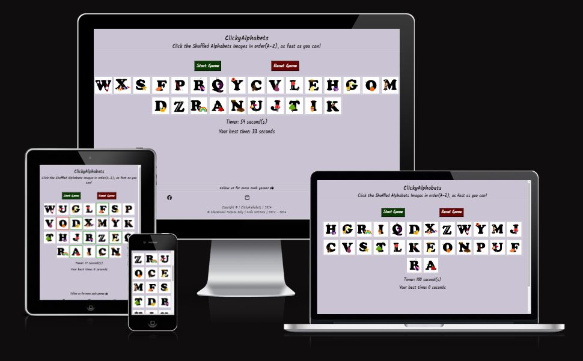

# Introduction

 [ClickyAlphabets website](https://swathikeshavamurthy.github.io/Clicky-Alphabets-P1/), engage the users in self-defeating competition and simple entertainment in addition to mental exercise. While you try to beat your personal record, the game is entertaining, simple to learn, and has the potential to become slightly addictive.

# Table of Contents

- [ClickyAlphabets](#clickyalphabets)
- [Introduction](#introduction)
- [Table of Contents](#table-of-contents)
- [User Goals and Stories (UX)](#user-goals-and-stories-ux)
    - [Website Owner and User Goals](#website-owner-and-user-goals)
      - [The owner's goals](#the-owners-goals)
      - [The user's goals](#the-users-goals)
    - [Website Owner and User Stories](#website-owner-and-user-stories)
      - [The owner's stories](#the-owners-stories)
      - [The user's stories](#the-users-stories)   
- [Design of the website](#design-of-the-website)
  - [Wireframes](#wireframes)
  - [Fonts](#fonts)
  - [Color Scheme and Colors](#color-scheme-and-colors)
  - [Images](#images)
  - [Icons](#icons)
  - [Text](#text)  
- [Features](#features)
  - [Existing Features](#existing-features)
    - [Heading of the Game](#heading-of-the-game)
    - [Game description](#game-description)
    - [Start Game](#start-game)
    - [Reset Game](#reset-game)
    - [Alphabets](#alphabets)
      - [Correct Click](#correct-click)
      - [Incorrect click](#incorrect-click)
    - [Timer](#timer)
    - [Your Best Time](#your-best-time)  
    - [Footer](#footer)
  - [Future Features](#future-features)
- [Deployment](#deployment)
- [Languages](#languages)
- [Technologies](#technologies)
- [Testing](#testing)
  - [Validation](#validation)
    - [HTML Validator](#html-validator)
    - [CSS Validator](#css-validator)
    - [JavaScript Validator](#javascript-validator)
  - [Lighthouse in Chrome Developer Tools](#lighthouse-in-chrome-developer-tools)
  - [Responsiveness](#responsiveness)
  - [Browser Compatibility](#browser-compatibility)
  - [Manual testing](#manual-testing)
- [Deployment](#deployment)
- [Bugs](#bugs)
  - [Known Bugs](#known-bugs)
  - [Fixed Bugs](#fixed-bugs)
  - [Unfixed bugs](#unfixed-bugs)
- [Credits](#credits)
  - [Code](#code)
  - [Media](#media)
  - [Others](#others)
  - [Acknowledgments](#acknowledgments)

# User Goals and Stories (UX)

## Website Owner and User Goals

### The owner's goals

- The purpose of the entertaining and engaging game is to draw visitors to the website.
- The website's owner wants visitors to stay put.
- More games ought to be played by returning visitors.

### The user's goals

- The user wants to play a game on their preferred device that is simple to access.
- To keep things from getting monotonous, the game should offer some challenge.
- It must be easy to start playing whenever they want to pass the time.

## Website Owner and User Stories

### The owner's stories

- The owner values it when visitors return to the website and want to play additional games.
- A competitive element that will aid in achieving those objectives can be added by using a timer or another comparable game element.
- Additional revenue could be generated by the website with sufficient traffic and user retention.

### The user's stories

- The user wants to pass the time, but what they do need to offer some sort of challenge. 
- It must be quick and simple for users to pick up and play wherever they are.
- They are certain to return for more if the game allows them to compete against one another.

# Design of the website

To help users find what they're looking for quickly and precisely without having to scroll through a ton of content, the website is divided into four distinct pages.

Information about the products and the uses are the site's top priorities. Additionally, through links with clear labels, the user can access the products and enquire page.

Along with this a Thank you page will open after submitting in the enquire form.

Users can enquire about the products and get installed  using the form on the enquire now page.

The company's motto is to "increase Electric Vehicles (EV) chargers accessibility to all at very cheap and quality product".
The layout is kept uncomplicated and tidy and has been used minimalist colour scheme and design.

# Design of the website

To help users the website and game has been designed userfriendly.

## Wireframes

Here are the first wireframes from the design stage. Every design element was put into practice with the help of [Balsamiq Wireframes](https://balsamiq.com/wireframes/)

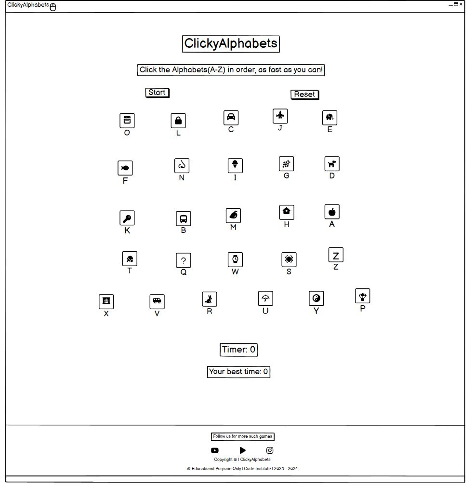 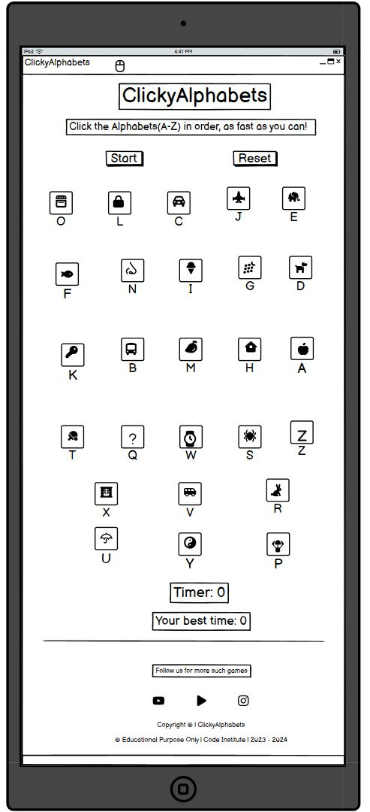 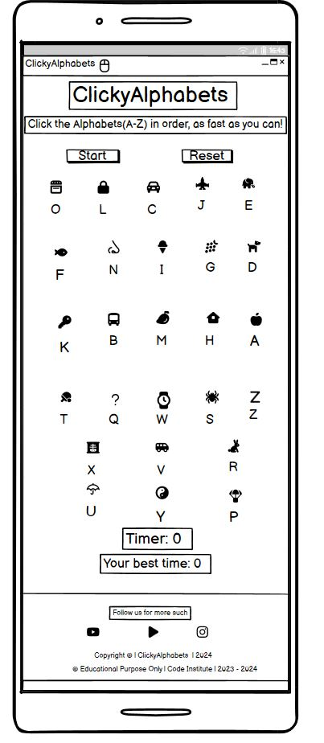

## Fonts

[Google Fonts](https://fonts.google.com/) were used to import the fonts. Fonts chosen were "Kalam" and "Lato". "sans serif" was chosen as the backup font.

## Color Scheme and Colors

Color black, and white was chosen for the font color as it attracts the users eyes.

The dark green and maroon color for Start Game and Reset Game buttons. Red and Green for correct and incorrect click on images.

## Images

Images were downloaded from Pexels and Pinterest and resized for the purpose of this website. The owners are credited in the Credits section.

## Icons

Icons were taken from Fontawesome website [Fontawesome](https://fontawesome.com/) and resized using [Favicon.io](https://favicon.io/).

# Features

## Existing Features

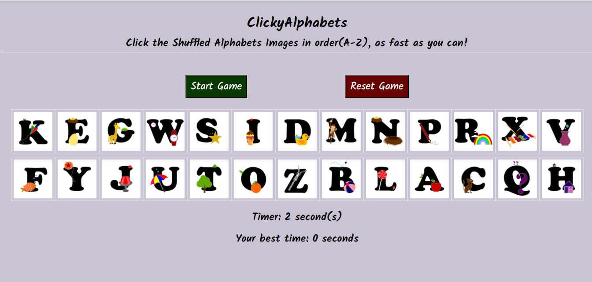

### Heading of the Game

You can tell exactly what the game is about from the page heading.

### Game Description

A synopsis of how the game is played.
Without being overbearing with information, this will help new players quickly grasp how the game is played.

### Start Game

   

- In order to begin the game, you must press the start game button. All of the Alphabet images will appear and timer will start once you click the Start Game button.
- This allows the player to launch a game whenever they want.
- The hover effect on the button is a helpful visual cue.

### Reset Game

  
 
It is simple for the user to reset the entire game area with a single button press thanks to the button's multiple built-in functions:

- The alphabet images are replaced with fresh, randomly arranged ones when the board is reset.
- The alphabet images that were colored by clicks in the previous game are now reset to their original colors.
- The timer is reset to 0 seconds.
- Playing a new game requires pressing reset and start again because it ends the current one.
- The alphabetical order in which they should be clicked is also reset by it.
Reset must be pressed after the game is over in order to begin a new one.

This allows the user to take a moment to consider the game they just finished before the game area is reset.
The hover effect on the reset button provides a useful visual cue for the user.

### Alphabets

All of the Alphabet images will appear and timer will start once Start Game button is clicked.
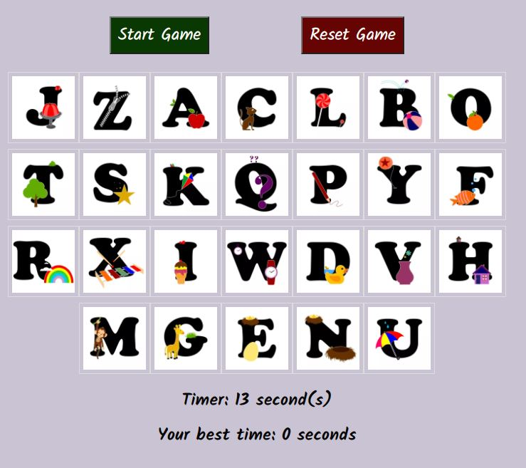

#### Correct Click

- The alphabet is arranged randomly, with a new placement for every game.
- By doing this, the game stays unpredictable and ensures that each game presents a fresh challenge.
- The backdrop will turn green when the clicks are made in the right order.
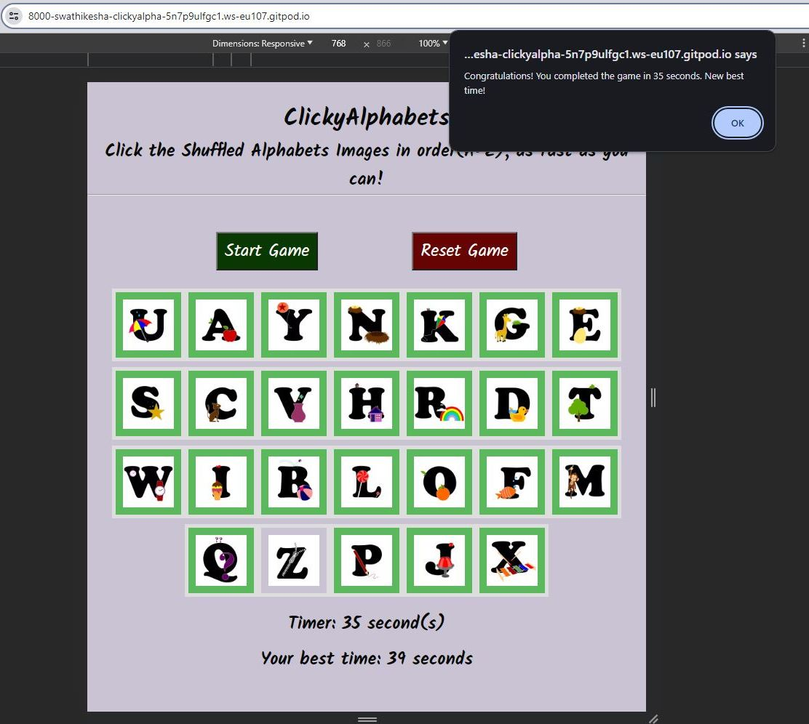

#### Incorrect Click

- A quick and simple method for the player to verify that they selected the right alphabet.
- A mistaken click will cause the background to turn red.
- A simple method for the player to realize that they selected the wrong alphabet.
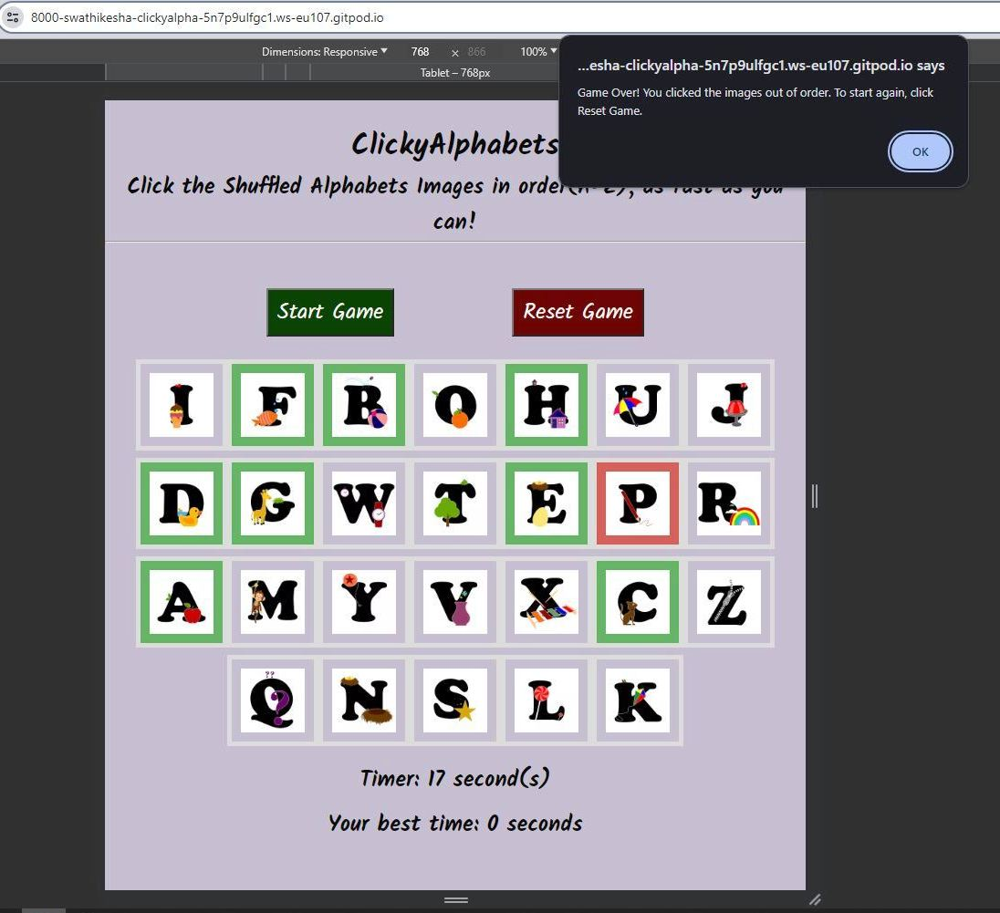

### Timer

- The game will launch the timer.
- The timer gives the player a competitive element, which increases the user's interest in the game.
- When the game is over or finished, it stops.
- Helpful in letting the player know how quickly they finished the current game.
- Resets upon pressing the reset button.
- It's simple for the user to reset everything relevant between games with a single button.
  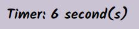

### Your Best Time

- The first game finished will be recorded on the screen, giving subsequent attempts a benchmark.
- The addition of a timer to the player's arsenal should make for an entertaining gameplay feature.
- When the game is over, the best time feature looks at the timer's value. If you beat your previous record, it will record your new best time on the screen.
- The user should feel proud of themselves because they beat their own record.
  

### Footer

The footer is visible at the bottom of the page so that social media links always available to the user.
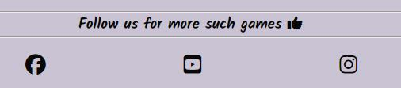

 Below all these there is a disclaimer for copyright.

## Future Features

A variety of difficulty settings would be included in the finished game. 

- A timer with intervals of 30, 45 and 60seconds is included in each increasingly difficult level.
- It would be more difficult to remember which alphabets have already been clicked if the colors were taken off of them when the hardest setting is selected.
- The absence of visual cues would make it more difficult to locate the alphabets you're looking for.
- Log In- If you want to save your score, you might need to log in.
- Sound effects are optional.

Alternative might be used like colors or numbers in place of alphabets.

# Languages 

- [HTML5](https://en.wikipedia.org/wiki/HTML5) (Hypertext Markup Language) or HTML, was used to design the basic website index.html.
- [CSS3](https://en.wikipedia.org/wiki/Cascading_Style_Sheets)
(Cascading Style Sheets) or CSS, was used to style the website and improve its user interface in style.css.
- [JS](https://en.wikipedia.org/wiki/JavaScript) (JavaScript) or JS was used as scripting language for Web page in script.js.
- [MD](https://en.wikipedia.org/wiki/Markdown) (MarkDown) or MD was used to documentation of README.md

# Technologies 

- [GitPod](https://www.gitpod.io/docs/introduction), cloud based IDE.
- [Github](https://github.com/), for documentation and deployment.
- [Balsamiq](https://balsamiq.com/), for creating wireframes.
- [Google Fonts](https://fonts.google.com/), for text styling.
- [Google](https://www.google.com/), search tool.
- Chrome developer tools.
- [Convert-to-webp](https://image.online-convert.com/convert-to-webp) was used to convert images to webp format.
- [Fontawesome](https://fontawesome.com) was used for the social media icons
- [Favicon](https://favicon.io/) was used to resize title icon for all devices.
- [Am I Responsive](https://ui.dev/amiresponsive) was used to get a responsive image for README.

# Testing

## Validation

### HTML Validator

[HTML Validator](https://validator.w3.org/) was run at several points during the project and small syntax errors identified were fixed. At the final stage no errors were found. 

Results and Full Validation results are here

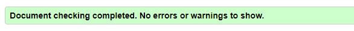 

<a href="https://github.com/SwathiKeshavamurthy/Clicky-Alphabets-P1/blob/main/documentation/validation-results/index.html-Showing%20results%20for%20contents%20of%20text-input%20area%20-%20Nu%20Html%20Checker.pdf" target="_blank"> CLICK HERE </a>

 ### CSS Validator

 [CSS Validator](https://validator.w3.org/) was run several times during the project and small syntax errors like brackets closure which were corrected. At the time of submission the CSS code successfully passed the validator with no errors.

Results and Full Validation results are here

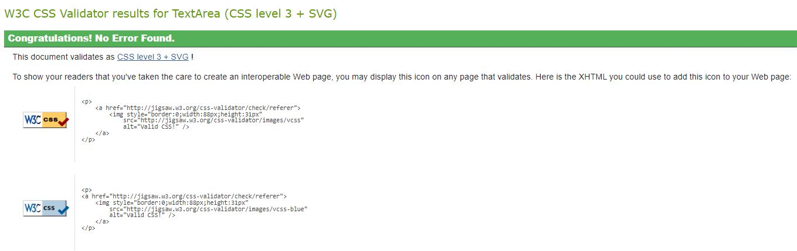

<a href="https://github.com/SwathiKeshavamurthy/Clicky-Alphabets-P1/blob/main/documentation/validation-results/style.css-W3C%20CSS%20Validator%20results%20for%20TextArea%20(CSS%20level%203%20%2B%20SVG).pdf" target="_blank"> CLICK HERE </a>

### JavaScript Validator

[JSHint](https://jshint.com/) was run during the project and all the errors were resolved. With one warning and one unused variable.

Results and Full Validation results are here

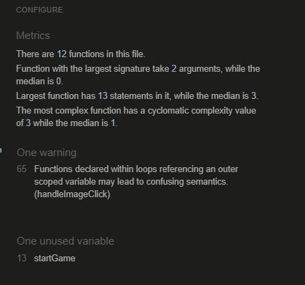

<a href="https://github.com/SwathiKeshavamurthy/Clicky-Alphabets-P1/blob/main/documentation/validation-results/JSHint%2C%20a%20JavaScript%20Code%20Quality%20Tool.pdf" target="_blank"> CLICK HERE </a>

## Lighthouse in Chrome Developer Tools

The following lighthouse report was run on the finished deployed website to check performance.

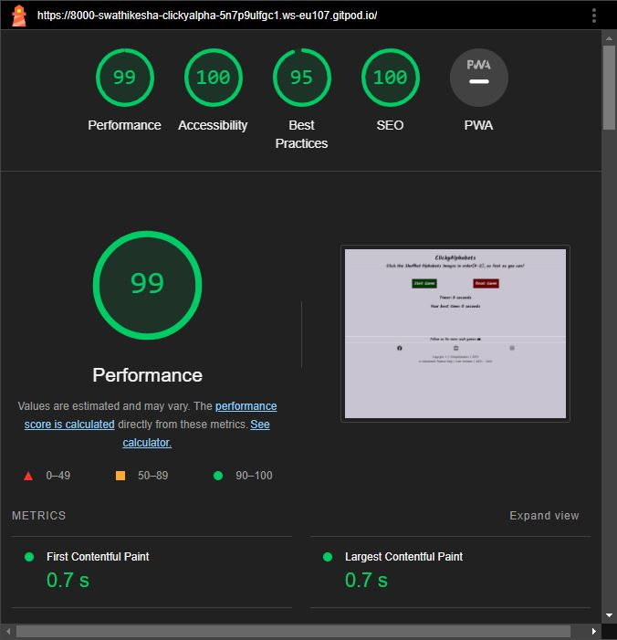

## Responsiveness

The website performed as expected across a wide range of screen sizes when tested on development tools on a variety of devices, including a Samsung S9, Nexus 10, Nest Hub, iPhone X,Samsung Galaxy Fold, Iphone 12 Pro and tablets etc..
The design process made use of the Chrome development tools to verify breakpoints and responsiveness. Accordingly adjustments were made.

## Browser Compatibility

Browser tests on Chrome, Firefox, and Microsoft Edge revealed no issues with the website.

## Manual Examination

On a computer, tablet, Samsung A53, and iPhone 13, manual testing was done.
Microsoft Edge, Safari, Firefox, and Chrome were the browsers used for testing.

### Start Game button
- Color transition when mouse is hovered over.
- When clicked, shows all alphabets and initiates a timer.

### Reset Game button.
- Color transition when mouse is hovered over.
- Sort alphabets by random display.
- Sets the timer back to zero.
- When clicked, all alphabets' backgrounds are changed to normal.

### Alphabets
- The background turns green when the alphabets are clicked correctly.
- The background turns red when alphabets are clicked incorrectly.

### Timer
 - The timer begins when the game launches. 
- The timer ends when the game is finished, when the reset button is pressed, or both.

### Your best time
 - The time that you spend finishing the first game will be shown as Your best time. 
- Your best time will accurately appear if you beat your previous time.

All the above tests were tested manually on all screens. All the images are attached above for the reference.

# Deployment

I followed these steps to deploy the website to GitHub Pages:

1. From the project's [Github](https://github.com/SwathiKeshavamurthy/Clicky-Alphabets-P1) repository.
2. From the top navigation menu, select the settings icon.
3. Select Pages from the menu on the left.
4. Select "deploy from branch."
5. Choose "/(root)" and "main."
6. Select "Save."

The project is now available from the project repository following the completion of the build.
There is a tab labeled Deployments on the right side; select it to see a link to the deployed website under Active Deployments.

This is the URL of my live website: [Clicky Alphabets](Clicky-Alphabets-P1/https://swathikeshavamurthy.github.io)

# Bugs

## Known Bugs

### Bug1

- When running my code through jshint, I got a warning saying: 

'const' is available in ES6 (use 'esversion: 6') or Mozilla JS extensions (use moz).

'for of' is available in ES6 (use 'esversion: 6') or Mozilla JS extensions (use moz).

'let' is available in ES6 (use 'esversion: 6') or Mozilla JS extensions (use moz).

### Bug2

- When running my code through jshint, I got a warning saying: 

One warning

66	Functions declared within loops referencing an outer scoped variable may lead to confusing semantics. (handleImageClick)

### Bug3

- When running my code through jshint, I got a warning saying:

One unused variable

14	startGame

### Bug4

- During manual testing, the timer was running fast and the timer was was always set to 1 even after Reset Game.

## Fixed Bugs

### Bug1

After researching on Google added these two comments at the start of script.js
/* eslint-env es6 */
/* jshint esversion: 6 */

Now this bug has been fixed.

### Bug4

Made changes in the function resetGame() code.

Now this bug has been fixed.

## Unfixed Bugs

### Bug2

- When running my code through jshint, I got a warning saying: 

One warning

66	Functions declared within loops referencing an outer scoped variable may lead to confusing semantics. (handleImageClick)

I tried to add fix it with another function but it led to other errors and it didn't work as expected. So, I left as it is, as it is not affecting the total functionally of the game.

### Bug3

- When running my code through jshint, I got a warning saying:

One unused variable

14	startGame

I tried to add if and else conditional statements instead of function(), but it didn't work as expected and led to others errors. So, I left as it is, as it is not affecting the total functionally of the game.

# Credits

## Code

- Code for [ParseInt](https://stackoverflow.com/questions/4659492/using-javascripts-parseint-at-end-of-string)
- Code for [Alphabet Generation](https://forum.freecodecamp.org/t/alphabet-generation-in-js-are-there-any-constants/532843)
- Code for [Create an array of Characters](https://stackoverflow.com/questions/12376870/create-an-array-of-characters-from-specified-range)
- Code for [Shuffle Algorithm (Fisher Yates Algorithm)](https://www.geeksforgeeks.org/shuffle-a-given-array-using-fisher-yates-shuffle-algorithm/)

## Media

Images downloaded from [Pinterest](https://in.pinterest.com/)
Special thanks to [Haamim Ali](https://in.pinterest.com/haamimali/english-alphabet/)

## Others

- This project is inspried by [ClickTheNumber](https://projects.marcnitzsche.de/ClickTheNumber/)
- The project [Love Maths](https://github.com/Code-Institute-Solutions/love-maths-2.0-sourcecode) 

## Acknowledgments

- I am grateful to my Code Institute mentor Jack Wachira for instructing for Timer function and for his insightful counsel and constructive criticism regarding the project's planning and implementation. 
- Thanks to Kristyna, Cohort facilitator at Code Institute how gave infromation about README references and depth of the project timelines.